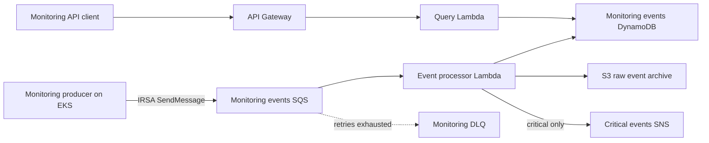
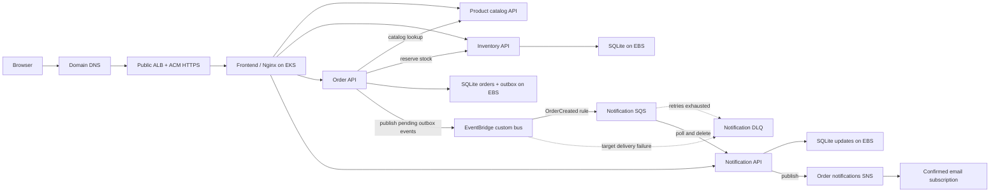

# Roast & Relay Coffee Store and Event-Driven Monitoring on AWS

This repository manages the shared AWS development platform for the Roast & Relay Coffee Store and its separate Kubernetes event-driven monitoring demo. Terraform manages AWS infrastructure; GitHub Actions uses OIDC for infrastructure and application delivery.

## Architecture



The Coffee Store runs separately in the same EKS cluster. An internet-facing Application Load Balancer routes browser requests to the frontend Service; Nginx routes API requests to the product, inventory, order, and notification Services. The five images are built from the `retail-application` repository and pushed to ECR. The current lab app uses encrypted EBS-backed SQLite volumes for inventory, orders, and notifications; it does not use the RDS, Valkey, or retail DynamoDB business resources now pending removal.

Order notifications use the existing retail EventBridge bus and SQS notification queue:



The order service uses a SQLite transactional outbox so an EventBridge outage does not silently discard the notification event after an order is committed. SQS delivery is at-least-once; consumers must tolerate duplicates. The DLQ has a CloudWatch alarm routed to the existing monitoring SNS topic.

## Monitoring components

| Component | Responsibility |
|---|---|
| Kubernetes event producer | Sends sample health and service events to SQS using its dedicated IRSA role. |
| Event processor Lambda | Processes queued events, archives raw payloads in S3, stores searchable records in DynamoDB, and publishes critical alerts to SNS. |
| Query API Lambda | Reads event records from DynamoDB for API requests. |
| API Gateway HTTP API | Exposes read-only event query endpoints. |

SQS, SNS, S3, DynamoDB, API Gateway, and CloudWatch are managed AWS services supporting the application components.

## Existing AWS foundation

The project reuses the existing `us-east-2` VPC, EKS cluster, worker nodes, EKS OIDC provider, GitHub Actions OIDC role, ECR, and Terraform state bucket. Existing retail resources remain tracked in Terraform until a reviewed plan removes resources no longer needed by this project.

## Repository layout

```text
infrastructure/       Terraform bootstrap, modules, and dev environment
kubernetes/           Namespace and event-producer Kubernetes manifests
lambda/               Event processor and query API Lambda code
docs/                 Architecture, runbook, and demo evidence
.github/workflows/    Terraform, platform deployment, and security workflows
```

## Delivery flow

1. GitHub Actions authenticates to AWS using OIDC.
2. Terraform plans infrastructure changes against the existing S3 remote state.
3. The infrastructure workflow can add the EBS CSI add-on and IRSA role, monitoring alarms, and optional confirmed SNS email subscription.
4. A manually triggered workflow in `retail-application` builds all five Coffee Store images, publishes immutable run tags to ECR, applies AWS-specific Kubernetes manifests, and checks Deployment rollouts.
5. The platform workflow separately builds and deploys the monitoring event producer; Lambda functions process monitoring SQS messages and serve queries through API Gateway.

## Security checks

The `Security checks` workflow runs on pushes to `dev`, pull requests targeting `main`, and manual dispatch. Gitleaks scans Git history for secrets; Checkov checks Terraform, Kubernetes, Docker, and workflow configuration; Trivy scans dependencies and configuration for fixable high and critical findings. Configure the security scan job as a required status check on `main` to block merges when scans fail. The manual Terraform and deployment workflows do not call the security workflow and are not automatically gated by its result; verify a passing scan for the revision being deployed. GitHub Actions uses OIDC for AWS access.

## Project status

- VPC, EKS, ECR, messaging, and monitoring resources remain in the dev Terraform configuration. RDS MySQL, Valkey, and retail inventory/notification DynamoDB are pending removal.
- Terraform code has been consolidated into this repository and validated against the existing state.
- Monitoring-specific SQS/DLQ, SNS, S3, DynamoDB, Lambda, API Gateway, and event-producer code are implemented in Terraform and the repository.
- The AWS Coffee Store deployment manifests and manual five-image build/deploy workflow live in `retail-application`.
- The AWS Coffee Store order path publishes `OrderCreated` events to EventBridge, fans them out through SQS, and publishes customer updates through SNS using per-service IRSA roles.
- A pending Terraform change removes the unused inventory SQS queue, its DLQ, EventBridge target, queue policy, and outputs. Review the destroy plan and queued messages before applying it.
- A pending Terraform change removes the unused RDS MySQL instance, Valkey cache, and retail inventory/notification DynamoDB tables. Back up any needed data and review the exact destroy plan before applying it. The monitoring DynamoDB table remains.

## Cost notes

The NAT Gateway, EKS cluster and nodes, RDS instance, and Valkey cache can incur ongoing charges until the pending Terraform removal is applied. Removing code alone does not delete deployed AWS resources. The RDS configuration skips a final snapshot, and Valkey automatic snapshot retention is disabled; back up any data you might need first.
