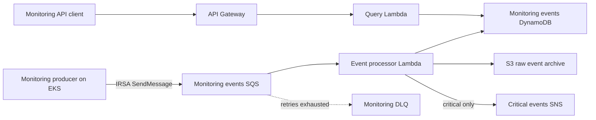
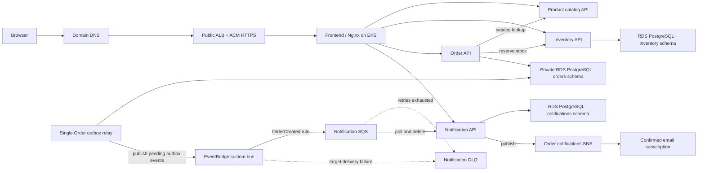

# Roast & Relay Coffee Store and Event-Driven Monitoring on AWS

The Coffee Store application source, local development setup, and AWS deployment manifests are maintained in the [retail-application repository](https://github.com/oguduf/retail-application).

This repository manages the shared AWS development platform for the Roast & Relay Coffee Store and its separate Kubernetes event-driven monitoring demo. Terraform manages AWS infrastructure; GitHub Actions uses OIDC for infrastructure and application delivery.

## Architecture



The Coffee Store runs in EKS. An internet-facing Application Load Balancer routes browser requests to the frontend; Nginx routes API calls to the microservices. Terraform provisions one private PostgreSQL RDS instance with separate schemas and IAM database users for Orders, Inventory, and Notifications. Local development remains SQLite-only. Request-serving workloads use CPU-based HPA for replica counts and bounded memory VPA policies for per-Pod sizing; the singleton outbox relay remains one replica. Karpenter adds and consolidates on-demand nodes when Pods cannot fit, within explicit node, CPU, and memory ceilings. A small managed node group remains as stable capacity for cluster add-ons and the Karpenter controller.

Order notifications use the existing retail EventBridge bus and SQS notification queue:



The Orders API writes orders and transactional outbox records to the `orders` schema. Inventory records stock and reservations in `inventory`; Notifications writes updates in `notifications`. Each workload has its own IRSA role and IAM-authenticated DB user. A separate one-shot schema bootstrap Job role can read the RDS-managed master credential; API Pods never receive the master password. SQS delivery is at-least-once; consumers must tolerate duplicates. The DLQ has a CloudWatch alarm.

## Monitoring components

| Component | Responsibility |
|---|---|
| Kubernetes event producer | Sends sample health and service events to SQS using its dedicated IRSA role. |
| Event processor Lambda | Processes queued events, archives raw payloads in S3, stores searchable records in DynamoDB, and publishes critical alerts to SNS. |
| Query API Lambda | Reads event records from DynamoDB for API requests. |
| API Gateway HTTP API | Exposes read-only event query endpoints. |

SQS, SNS, S3, DynamoDB, API Gateway, and CloudWatch are managed AWS services supporting the application components.

## Terraform-managed platform

Terraform defines the VPC, EKS, ECR, RDS PostgreSQL, messaging, and monitoring resources. The AWS resources were cleaned up after Week 3; this repository change does not create any AWS resources. Before applying, bootstrap the Terraform S3 state bucket and verify GitHub OIDC variables and permissions.

## Repository layout

```text
infrastructure/bootstrap/          S3 remote-state backend and access logs
infrastructure/environments/dev/   Dev root module and outputs
infrastructure/modules/            Network, EKS, database, messaging, monitoring, observability, and budget modules
kubernetes/           Namespace and event-producer Kubernetes manifests
helm/                 Development values for the AWS Load Balancer Controller chart
lambda/               Event processor and query API Lambda code
docs/                 Architecture, runbook, migration/cost plan, and demo evidence
.github/workflows/    Terraform, platform deployment, and security workflows
```

The dev root calls the component modules from `main.tf`. The database, budget, and CloudWatch resources are defined in their own modules. No Terraform state migration is required for these resources because they were not applied before the refactor.

## GitHub Actions workflows

| Workflow file | Purpose |
|---|---|
| `.github/workflows/terraform-dev.yml` | Validates and plans platform changes, supports reviewed apply/destroy operations, and runs weekly read-only drift detection. Requires the remote-state bucket to exist first. |
| `.github/workflows/deploy-event-producer.yml` | Manually builds and pushes the monitoring event-producer image, applies its Kubernetes resources to EKS, and checks the rollout. It reads deployment values from Terraform state. |
| `.github/workflows/deploy-load-balancer-controller.yml` | Manually installs or upgrades the AWS Load Balancer Controller with Helm, using `helm/aws-load-balancer-controller/values-dev.yaml`, then verifies its rollout. |
| `.github/workflows/deploy-karpenter.yml` | Installs the pinned Karpenter controller and applies the bounded dev NodePool after Terraform has been applied. |
| `.github/workflows/ci.yml` | On pushes to `dev`, pull requests to `main`, and manual runs: validates Terraform, scans for secrets and configuration/dependency issues, and builds/scans the event-producer image without deploying. |

## Delivery flow

1. GitHub Actions authenticates to AWS using OIDC.
2. Terraform plans infrastructure changes against the existing S3 remote state.
3. Terraform provisions the EKS CloudWatch Observability add-on, 14-day application log retention, a dashboard, RDS alarms, 60-second RDS Enhanced Monitoring, and a configurable monthly cost budget (email alerts require `MONITORING_ALERT_EMAIL`).
4. The platform `Deploy Karpenter autoscaling` workflow installs the controller and bounded NodePool after Terraform has created its IAM roles, EKS access entry, and subnet/security-group discovery tags.
5. In `retail-application`, CI tests and scans the five services. A separate deployment workflow builds and pushes digest-pinned images, installs Metrics Server and VPA, deploys the Helm chart, and verifies rollouts, HPAs, and VPAs.
6. The platform workflow separately builds and deploys the monitoring event producer; Lambda functions process monitoring SQS messages and serve queries through API Gateway.

## CI and deployment gates

`Platform CI` runs on pushes to `dev`, pull requests targeting `main`, and manual dispatch. Gitleaks scans Git history for secrets; Checkov checks Terraform, Kubernetes, Docker, and workflow configuration; Trivy scans dependencies and configuration for fixable high and critical findings. CI also builds and scans the event-producer image without pushing it. Configure the CI jobs as required status checks on `main` to block merges when they fail.

Normal Terraform `apply` and the manual load-balancer controller, Karpenter, and event-producer deployments require a successful `Platform CI` **push** run for the exact commit selected on `dev`. The check runs before AWS authentication. Terraform `plan`, drift detection, Kubernetes cleanup, and destroy operations remain available so failed CI does not block inspection or teardown. The deployment workflows use GitHub OIDC for AWS access.

Trivy's file-scoped, expiring lab exceptions are documented in `.trivyignore.yaml`. They cover the public EKS API used by GitHub-hosted runners and AWS-managed encryption keys on the state bucket and SNS topics. A passing scan with these exceptions is not a production security sign-off; use private EKS API access and review customer-managed KMS keys and their publisher/key policies before production.

## Week 4 platform scope

- Orders, Inventory, and Notifications use separate schemas and IAM-authenticated DB users on private RDS PostgreSQL, with KMS encryption, Secrets Manager-managed master credentials, and a separate bootstrap role. Local development still uses SQLite.
- CPU-based HPAs scale Product, Inventory, Orders, Notifications, and Frontend between one and three replicas. Metrics Server supplies resource metrics. VPA adjusts bounded memory requests and limits; it can adjust CPU only for the singleton outbox relay so it does not conflict with CPU-based HPAs.
- The managed node group is deliberately fixed at one small node for core add-ons and controller availability. Karpenter adds on-demand C/M/R-family nodes as pending Pods require capacity and consolidates underused nodes; the dev NodePool is limited to three nodes, 12 vCPU, and 48 GiB. Karpenter evaluates these limits asynchronously, so a rapid burst can briefly exceed them. This is a bounded dev setup, not a guarantee of zero interruption or a production capacity plan.
- CloudWatch Observability collects EKS metrics and logs; dashboards and RDS alarms support operations. EKS log retention is set to 14 days.
- Terraform CI validates configuration and a weekly scheduled plan detects drift without applying changes. Recreate the remote state bucket before using the Terraform workflow.
- ECR/S3 lifecycle policies limit retained artifacts. An AWS Budget alerts at 80% actual and 100% forecasted spend when `MONITORING_ALERT_EMAIL` is configured; budgets do not stop spend.

## Cost notes

This design is a lab baseline, not a production HA deployment. RDS Multi-AZ is enabled by default with a standby in another Availability Zone, and 60-second Enhanced Monitoring publishes OS metrics to CloudWatch Logs. Both increase cost; RDS destroy still skips a final snapshot. The single NAT Gateway and baseline EKS node remain availability limitations. The NAT Gateway, EKS control plane/nodes, ALB, RDS, CloudWatch ingestion, and data transfer can all incur costs. A budget is an alert, not a hard cap. Production should enable deletion protection and final snapshots, define RTO/RPO, test restores and failover, and validate per-AZ network resilience. Nothing in this repository update has been applied to AWS.
