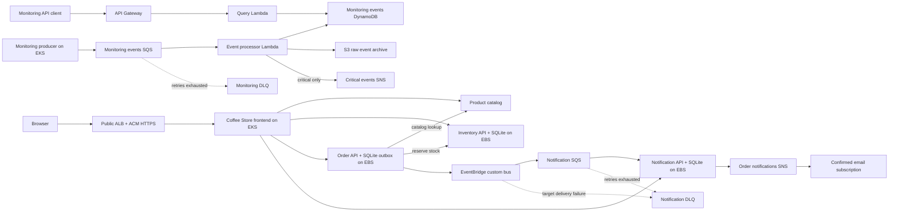

# Architecture

## Event flow

The Coffee Store and monitoring producer share EKS but have separate event pipelines. The AWS app keeps SQLite for inventory, orders, and notification records on encrypted gp3 EBS volumes. The Order service reserves inventory over HTTP, commits the order with a transactional outbox event, and publishes `OrderCreated` to EventBridge. The Notification service consumes its SQS queue, records an update for the UI, and publishes a formatted SNS email. The monitoring queue sends operational events to Lambda for S3 archival and DynamoDB storage.

## Components and responsibilities

- The event producer runs in EKS and sends operational events to SQS. It has permission only to send messages to its queue.
- SQS buffers events and invokes the processor Lambda. A dead-letter queue retains messages that fail repeated processing.
- The processor Lambda validates each message, stores the raw event in S3, writes queryable event attributes to DynamoDB, and publishes critical events to SNS.
- The query API Lambda reads event records. API Gateway exposes `GET /events` and `GET /events/{eventId}`.
- CloudWatch collects logs and alarms on processor/API errors and messages accumulating in the dead-letter queue.

## Existing infrastructure reuse

Reuse the existing VPC, EKS cluster, worker nodes, EKS OIDC provider, GitHub OIDC role, ECR service, and Terraform S3 state bucket. Create monitoring-specific queues, tables, archive bucket, topic, Lambda functions, and API Gateway resources.

The retail EventBridge bus and notification queue are active parts of the Coffee Store. The existing RDS MySQL instance, Valkey cache, and retail DynamoDB inventory/notification tables are not used by the current application code. Their dev module calls and outputs have been removed locally so that Terraform will plan their deletion; no AWS deletion has been applied yet. Back up needed data and review the destroy plan before applying. The unused inventory SQS target, queue, and DLQ are also pending cleanup in the current local Terraform changes. The separate monitoring-events DynamoDB table remains in use.

## Identity and security

- EKS event producer uses a dedicated Kubernetes service account and IRSA role scoped to `sqs:SendMessage` on its queue.
- Processor Lambda uses a dedicated role scoped to its queue, archive bucket prefix, DynamoDB table, and SNS topic.
- Query Lambda has read-only access to the event table.
- The archive bucket blocks public access, enables encryption, and uses lifecycle retention appropriate for the lab.
- CloudWatch alarms publish processor errors and a non-empty monitoring DLQ to the critical SNS topic. Email delivery is optional and requires a confirmed SNS email subscription.
- API Gateway exposes only the query operations needed for the demo. Authentication can be added if public access is not acceptable.

## Lab tradeoffs

One EKS cluster and the existing two worker nodes are reused. The design uses one queue and one dead-letter queue to keep the pipeline understandable. Production would add stricter API authentication, retention and recovery objectives, idempotency controls, multi-account separation, and centralized alert routing.
