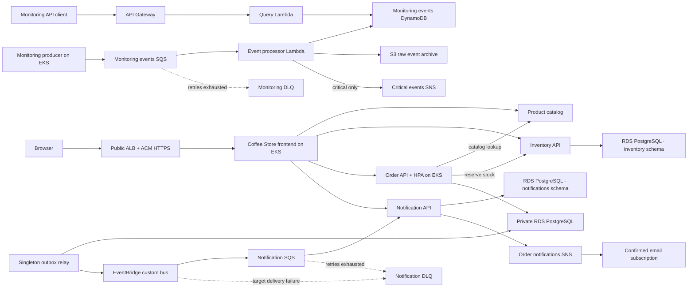

# Architecture

## Event flow

The Coffee Store and monitoring producer share EKS but have separate event pipelines. Orders, Inventory, and Notifications use separate schemas and IAM-authenticated users on private encrypted PostgreSQL RDS; local Compose keeps SQLite for zero-AWS development. The Order API writes a transactional outbox record, and a singleton relay publishes `OrderCreated` to EventBridge. This avoids competing publishers when the Order API HPA adds replicas. The Notification service consumes its SQS queue, records an update for the UI, and publishes a formatted SNS email. The monitoring queue sends operational events to Lambda for S3 archival and DynamoDB storage.

## Components and responsibilities

- The event producer runs in EKS and sends operational events to SQS. It has permission only to send messages to its queue.
- SQS buffers events and invokes the processor Lambda. A dead-letter queue retains messages that fail repeated processing.
- The processor Lambda validates each message, stores the raw event in S3, writes queryable event attributes to DynamoDB, and publishes critical events to SNS.
- The query API Lambda reads event records. API Gateway exposes `GET /events` and `GET /events/{eventId}`.
- CloudWatch collects logs and alarms on processor/API errors and messages accumulating in the dead-letter queue.

## Existing infrastructure reuse

Terraform declares the VPC, EKS cluster, worker nodes, OIDC roles, ECR, RDS, event infrastructure, and monitoring services. AWS resources were cleaned up after the previous lab; this code update does not recreate them. The S3 Terraform state bucket must be bootstrapped before remote-state workflows can run.

Terraform recreates the Coffee Store EventBridge bus, SQS notification queue, SNS topic, monitoring pipeline, and the Orders RDS database from this repository. No resources are currently created by these local code changes; the remote state bucket must be bootstrapped and a plan reviewed before applying.

## Identity and security

- EKS event producer uses a dedicated Kubernetes service account and IRSA role scoped to `sqs:SendMessage` on its queue.
- Each stateful app has an IRSA role with `rds-db:connect` scoped to its database user (`orders_app`, `inventory_app`, or `notifications_app`). A separate short-lived migration Job role reads the RDS-managed master secret only to bootstrap schemas, tables, and restricted database users.
- Processor Lambda uses a dedicated role scoped to its queue, archive bucket prefix, DynamoDB table, and SNS topic.
- Query Lambda has read-only access to the event table.
- The archive bucket blocks public access, enables encryption, and uses lifecycle retention appropriate for the lab.
- CloudWatch alarms publish processor errors and a non-empty monitoring DLQ to the critical SNS topic. Email delivery is optional and requires a confirmed SNS email subscription.
- API Gateway exposes only the query operations needed for the demo. Authentication can be added if public access is not acceptable.

## Lab tradeoffs

The dev environment uses a single NAT Gateway, a small Multi-AZ RDS instance, and bounded EKS capacity. The database has a standby and 60-second Enhanced Monitoring; both increase cost. Product and Order HPAs scale Pods, while Karpenter can add nodes when Pods cannot fit within the managed node baseline. The single NAT Gateway and baseline node remain availability limitations. Production would add deletion protection and final snapshots, tested recovery objectives, authenticated public APIs, idempotency controls, multi-account separation, and centralized alert routing.
