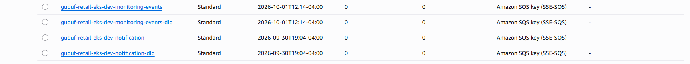
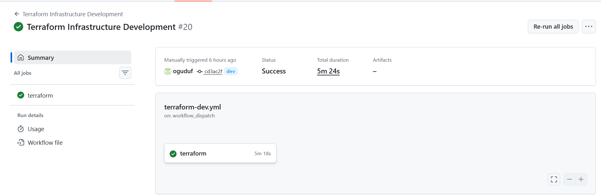
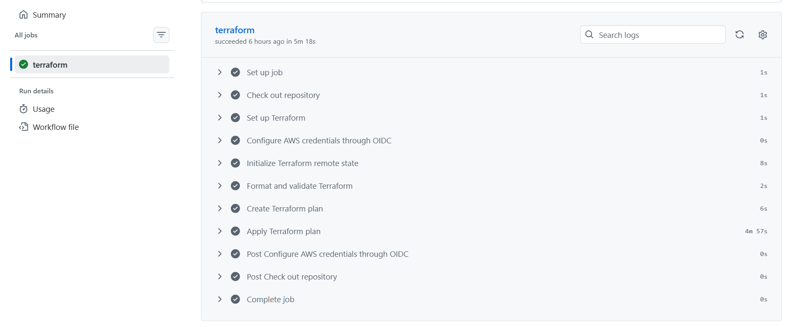
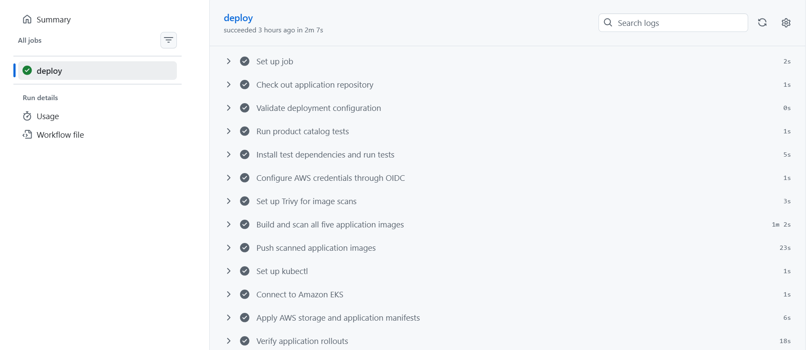
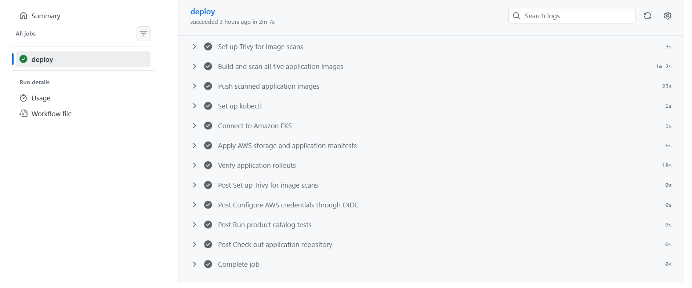
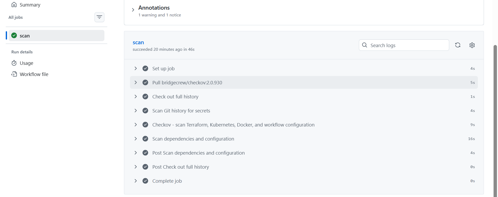

# Demo Evidence

Capture evidence as each project phase is completed.

## Captured evidence

### SQS queues after cleanup

At capture time, all four project queues showed zero available and zero in-flight messages. This is a point-in-time health check after the notification DLQ cleanup; it does not document the earlier consumer loop or prove its root cause.

### Terraform infrastructure deployment

The `dev` Terraform workflow completed successfully. The run summary identifies run #20 and commit `cd3ac2f`; the job steps show successful OIDC authentication, remote-state initialization, planning, and applying.

### Coffee Store application deployment

These screenshots show a successful application deployment job, including catalog tests, image scanning/building, pushing five application images, connecting to EKS, applying manifests, and verifying rollouts. They document the application deployment workflow, not a producer-only workflow; the screenshots do not show the repository or run title.

### Security scan

The GitHub Actions `scan` job completed successfully, with one warning and one notice. The supplied screenshot is cropped and does not show the repository or run title.

## Repository and CI/CD

- Terraform migration PR and successful no-change plan against the existing remote state
- Successful GitHub Actions OIDC authentication
- Successful Terraform plan/apply for monitoring resources
- Successful producer test, image build, and ECR push

## Shared AWS foundation

- Existing VPC and EKS cluster reused
- EKS worker nodes Ready
- Dedicated IRSA role for the event-producer service account

## Event pipeline

- Producer Pod sends a sample event to SQS
- Processor Lambda invocation and CloudWatch logs
- Event record appears in DynamoDB
- Raw event object appears in the private S3 archive bucket
- Critical event generates an SNS email notification
- Failed event is retained in the SQS dead-letter queue

## Query API

- API Gateway routes for `GET /events` and `GET /events/{eventId}`
- Successful response for an existing event and expected response for a missing event

## Operations and cost

- CloudWatch alarms for Lambda errors and DLQ message count
- Evidence of a failed message and recovery procedure
- Final Terraform plan or cleanup evidence for lab resources
